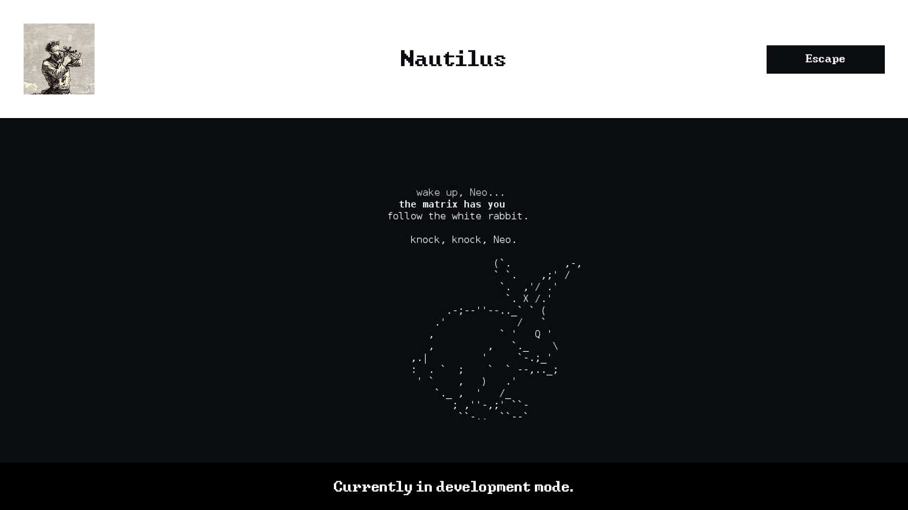

## About ##

Wordpress theme - Nautilus.
Core stripped to the bone:
-   Remove WP Version from CSS and JS files
-   Remove WP Version from header
-   Disable WordPress build in code editor
-   Clean WordPress from default enqueues (e.g. emojis etc.)
-   Disable inserting blank paragraphs in Contact Form 7
-   Disable Gutenberg Block Editor
-   Dequeue Gutenberg stylesheets
-   Remove WP Color Inline Styles
-   Disable Gutenberg Inline CSS Styles and SVG Duotone Filters from Header (WordPress 5.9+)
-   Disable WP Admin Bar
-   Completely Remove jQuery From (front) WordPress

Build with:
Vite : https://vitejs.dev/
PostCSS: https://postcss.org/
SASS: https://sass-lang.com/
ACF: https://www.advancedcustomfields.com/

### Main commands: ##
npm run dev
npm run build

### Main config files:  ###
vite.config.js
inc.vite.php

# To switch between prod / dev:
define("IS_VITE_DEVELOPMENT", true)
Ensure **define("IS_VITE_DEVELOPMENT", true);** exists in your **wp-config.php** or theme/plugin **functions.php**.
